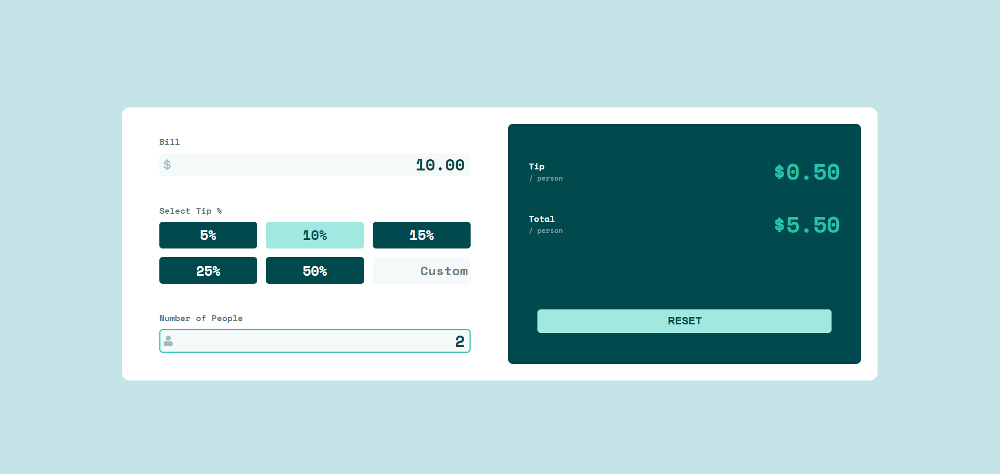

# Tip Split Calculator

## Live Site

🧾 [Tip Calculator](https://ktpeace.github.io/tip-calculator/)

## Team

🦉 [Aubrey Finkelstein](https://github.com/a-fink)

🐈‍ [Katherine Peace](https://github.com/ktpeace)

## Features

- Calculates correct tip & total cost of a bill per person
- Handles input errors & alerts user
- Allows user to reset values
- Displays optimal layout based on device screen size

## Built with

 - page framework and all components

 - as JSX within React

 - styling and media breakpoints for responsive design

 - conditional logic, mapping within React elements, etc.

  - version control across a distributed team

 - live site hosting

## Ideal Future Improvements

- Make cursor start at right side when input fields are clicked
- Add labels to HTML for accessibility & perform screen reader testing
- Add custom percent option

## Running the Project Locally

1. Clone from Github
2. `cd` into project directory in bash/command line
3. `npm install` to install dependencies
4. `npm start` to run the app in development mode
   - Open http://localhost:3000 to view it in your browser
   - The page will reload when you make changes
   - You may also see any lint errors in the console

## Acknowledgements

This is a solution to the [Tip calculator app challenge on Frontend Mentor](https://www.frontendmentor.io/challenges/tip-calculator-app-ugJNGbJUX).
